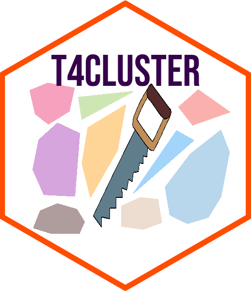

<!-- README.md is generated from README.Rmd. Please edit that file -->

```{r, include = FALSE}
knitr::opts_chunk$set(
  collapse = TRUE,
  comment = "#>",
  fig.path = "man/figures/README-",
  out.width = "100%"
)
```

# Tools for Cluster Analysis <a href='https://kisungyou.com/T4cluster/'></a>

<!-- badges: start -->
[](https://travis-ci.com/kisungyou/T4cluster)
[](https://cran.r-project.org/package=T4cluster)
<!-- badges: end -->

**T4cluster** is an **R** package designed as a computational toolkit with comprehensive coverage 
in relevant topics around the study of cluster analysis. It contains several classes of algorithms for 

* Clustering with Vector-Valued Data 
* Clustering with Functional Data
* Clustering on the Unit Hypersphere
* Subspace Clustering
* Measures : Compare Two Clusterings
* Learning with Multiple Clusterings

and other utility functions for further use. If you request additional functionalities or have suggestions, please contact maintainer.


## Installation

You can install the released version of T4cluster from [CRAN](https://CRAN.R-project.org) with:

``` r
install.packages("T4cluster")
```

And the development version from [GitHub](https://github.com/) with:

``` r
# install.packages("devtools")
devtools::install_github("kisungyou/T4cluster")
```

## Minimal Example : Clustering SMILEY Data

**T4cluster** offers a variety of clustering algorithms in common interface. In this example, we show a 
basic pipeline with `smiley` dataset, which can be generated as follows;

```{r message=FALSE, warning=FALSE, fig.align='center', fig.width=7}
# load the library
library(T4cluster)

# generate the data
smiley = T4cluster::gensmiley(n=200)
data   = smiley$data
label  = smiley$label

# visualize
plot(data, pch=19, col=label, xlab="", ylab="", main="SMILEY Data")
```

where each component of the face is considered as one cluster - the data has 4 clusters. Here, we compare 4 different methods; 
(1) *k*-means (`kmeans`), (2) *k*-means++ (`kmeanspp`), (3) gaussian mixture model (`gmm`), and (4) spectral clustering with normalized cuts (`scNJW`).

```{r message=FALSE, warning=FALSE, fig.align='center', fig.width=7}
# run algorithms
run1 = T4cluster::kmeans(data, k=4)
run2 = T4cluster::kmeanspp(data, k=4)
run3 = T4cluster::gmm(data, k=4)
run4 = T4cluster::scNJW(data, k=4, sigma = 0.1)

# visualize
par(mfrow=c(2,2))
plot(data, pch=19, xlab="", ylab="", col=run1$cluster, main="k-means")
plot(data, pch=19, xlab="", ylab="", col=run2$cluster, main="k-means++")
plot(data, pch=19, xlab="", ylab="", col=run3$cluster, main="gmm")
plot(data, pch=19, xlab="", ylab="", col=run4$cluster, main="scNJW")
```
